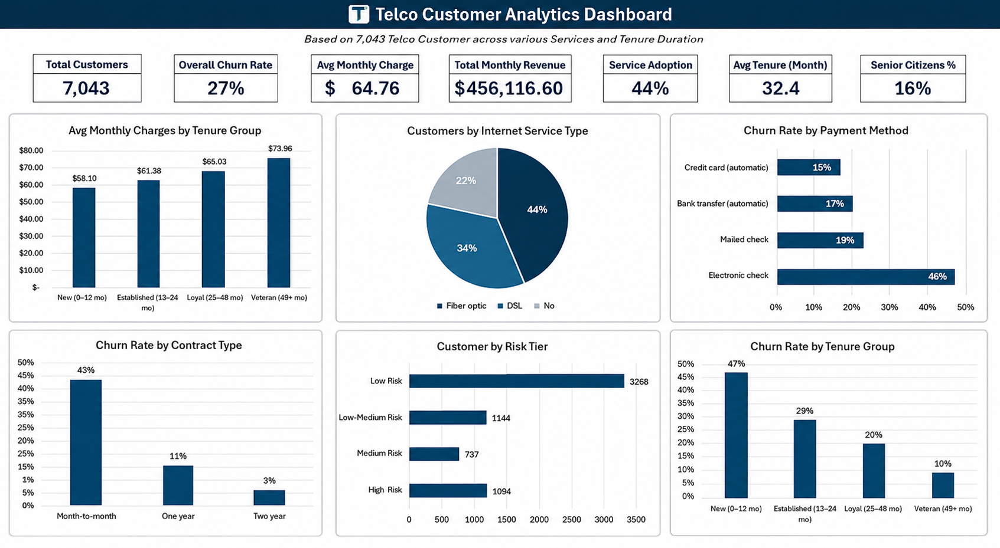

# 📊 Telco Customer Analytics — Excel Skills Portfolio


> An end-to-end Excel analytics project built on **7,043 real telecom customer records** — from raw data import and cleaning, through segmentation and aggregation, to an interactive customer lookup tool and a fully live dashboard. Every number in this workbook is driven by a formula; nothing is hardcoded.

---

## 🎥 Demo Walkthrough

[![Watch the demo]](https://drive.google.com/file/d/1FFdyr6-VFYW6AsqkUbzI6NCl-4rd56Zp/view?usp=sharing)

> 📌 Click the image above to watch a full walkthrough of the workbook — Dashboard, Customer Lookup tool, Summary Tables, and formula logic. (1 min 16 sec)

---

## 📁 Repository Structure

```
Telco-Customer-Analytics/
│
├── 📊 Telco_Customer_Analytics.xlsx    ← Main Excel workbook
│
├── 📁 data/
│   └── telco_customer_churn.csv        ← Raw dataset (source, untouched)
│
├── 📁 assets/
│   ├── dashboard.png                   ← Dashboard screenshot
│   └── demo.mp4                        ← Screen recording walkthrough
│
└── README.md
```

---

## 🗂️ Workbook Structure

```
Telco_Customer_Analytics.xlsx
│
├── 📋 Dashboard          → 7 KPI cards + 6 charts summarizing key business insights
├── 🔍 Customer Lookup    → Interactive tool: pick any Customer ID, profile populates live
├── 📈 Summary Tables     → SUMIFS / COUNTIFS / AVERAGEIFS rollups across 5 segments
├── 🔧 Analysis           → Cleaned and calculated fields built on top of raw data
└── 🗃️ Raw Data           → Original unmodified dataset formatted as an Excel Table
```

---

## 🗂️ Dataset

**Source:** [IBM Telco Customer Churn](https://github.com/IBM/telco-customer-churn-on-icp4d)

| Property | Detail |
|---|---|
| Records | 7,043 customers |
| Fields | 21 attributes |
| Target variable | `Churn` (Yes / No) |
| Coverage | Demographics, account info, subscribed services, billing |

> **Real data quality issue handled:** The `TotalCharges` column is stored as text in the source, and 11 brand-new customers (tenure = 0) have a blank value instead of a number. This was identified, documented, and cleaned using `IFERROR(VALUE(...), 0)` on the Analysis sheet — the Raw Data sheet is kept completely untouched as a rule of good practice.

---

## ✅ Excel Skills Demonstrated

| Skill | How It's Applied |
|---|---|
| **Excel Tables** | Raw data formatted as a named Table (`RawData`) for structured references |
| **Nested IFS** | Segments all 7,043 customers into 4 tenure lifecycle groups |
| **Nested IF** | Assigns a churn Risk Tier based on contract type + tenure combination |
| **IFERROR + VALUE** | Cleans the 11 blank `TotalCharges` entries from the source dataset |
| **COUNTIF** | Counts customers per segment; tallies "Yes" services per customer row |
| **COUNTIFS** | Multi-condition counts — e.g. churned customers within a specific contract type |
| **AVERAGEIFS** | Average monthly/total charges filtered by internet service type or tenure group |
| **INDEX / MATCH** | Powers the Customer Lookup tool — finds records by ID, not by row position |
| **TEXTJOIN** | Auto-generates a plain-English customer profile summary sentence dynamically |
| **Data Validation** | Dropdown of all 7,043 Customer IDs using a named range (`CustomerIDList`) |
| **Named Ranges** | `CustomerIDList` defined via Name Manager, scoped to the whole workbook |
| **EDATE** | Back-calculates each customer's estimated join date from their tenure in months |
| **Conditional Formatting** | Color scales on churn rates (red = high risk); data bars on customer counts |
| **Cross-sheet References** | Analysis pulls from Raw Data; Summary Tables pull from Analysis; Dashboard pulls from both |
| **Chart Design** | 6 charts linked to live formula outputs — update automatically if data changes |
| **Dashboard Design** | Single-view KPI card grid + 2-row chart layout with consistent visual language |

---

## 📊 Dashboard Preview



### KPI Cards
| Total Customers | Overall Churn Rate | Avg Monthly Charges | Total Monthly Revenue | Fiber Optic Adoption | Avg Tenure | Senior Citizen % |
|---|---|---|---|---|---|---|
| 7,043 | 27% | $64.76 | $456,117 | 44% | 32.4 mo | 16% |

### Charts
- **Churn Rate by Contract Type** — Column chart
- **Customers by Internet Service Type** — Pie chart
- **Avg Monthly Charges by Tenure Group** — Column chart
- **Churn Rate by Payment Method** — Horizontal bar chart
- **Customers by Risk Tier** — Horizontal bar chart
- **Churn Rate by Tenure Group** — Column chart

---

## 🔍 Key Findings

| Finding | Detail |
|---|---|
| 📌 Contract type is the strongest churn predictor | Month-to-month customers churn at **42.7%** vs only **2.8%** for two-year contracts |
| 📌 Fiber optic has a loyalty problem | **41.9% churn rate** despite being the highest-priced service ($91.50/mo avg) |
| 📌 New customers are the highest risk | Customers in their first 12 months churn at **47%** — nearly 5x the veteran rate |
| 📌 Electronic check payment is a churn signal | **45% churn rate** vs 15% for credit card automatic — nearly 3x the difference |
| 📌 Tenure is the best retention indicator | Veteran customers (49+ months) churn at only **9.5%** |
| 📌 High Risk segment confirmed | New month-to-month customers churn at **51%** — validating the Risk Tier segmentation logic |

---

## 🔧 How the Workbook Is Built

### Data Flow
```
Raw Data (Excel Table)
    ↓
Analysis Sheet
    → IFERROR(VALUE()) cleans TotalCharges
    → IFS() assigns Tenure Group (4 segments)
    → COUNTIF() tallies services per customer
    → Nested IF() assigns Risk Tier
    → EDATE() estimates join date
    ↓
Summary Tables Sheet
    → COUNTIFS / AVERAGEIFS / SUMIFS rollups
    → 5 analytical tables with conditional formatting
    ↓
Customer Lookup Sheet          Dashboard Sheet
    → Data validation dropdown      → KPI cards (live COUNTA/AVERAGE/SUM)
    → INDEX/MATCH profile lookup    → 6 charts linked to Summary Tables
    → TEXTJOIN summary sentence
```

### Design Decisions Worth Noting
- **INDEX/MATCH over XLOOKUP** — chosen deliberately for backward compatibility across all Excel versions
- **Raw Data never edited** — all cleaning and transformation happens on the Analysis sheet only, preserving the source as an audit trail
- **`$` absolute references** in all Summary Table formulas — ensures COUNTIFS ranges don't shift when formulas are copied down
- **Named range for dropdown** — `CustomerIDList` means the dropdown source is maintainable from one place (Name Manager), not buried in a Data Validation dialog

---

## 💡 How to Use

1. **Download** `Telco_Customer_Analytics.xlsx`
2. **Open in Microsoft Excel** (2016 or later recommended for IFS and TEXTJOIN support)
3. Start on the **Dashboard** tab for the high-level view
4. Go to **Customer Lookup** → click the dropdown in cell B2 → pick any Customer ID to see their full profile populate instantly
5. Explore **Summary Tables** to see the underlying segment rollups
6. Check **Analysis** to inspect the formula logic behind each calculated column

---

## 👩‍💻 Built By

**Haneen**
Data Analytics | Web Development | ERP Systems

[](www.linkedin.com/in/haneen-ayman-240051387)

---

*Dataset credit: IBM — shared for educational and portfolio use*
